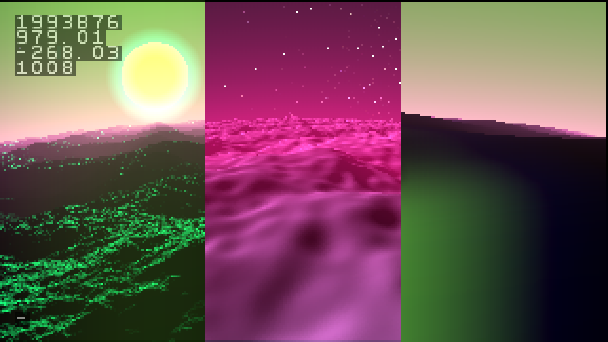
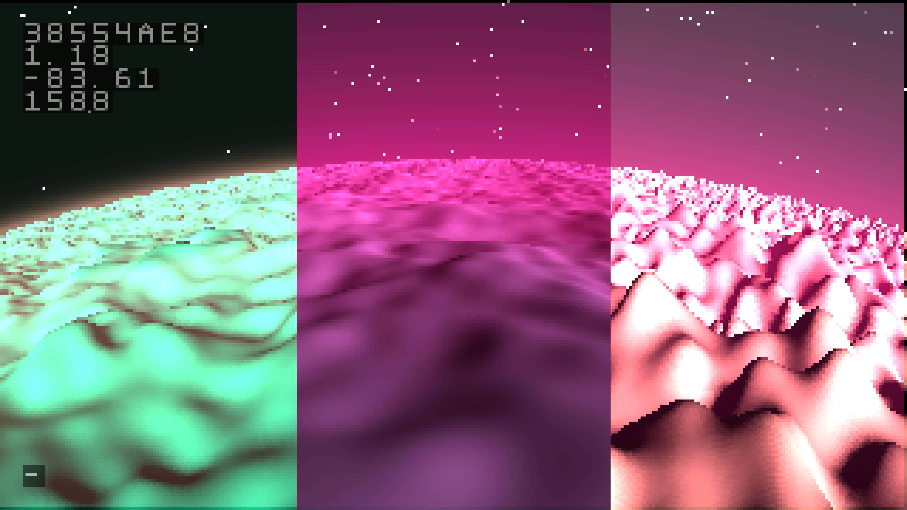
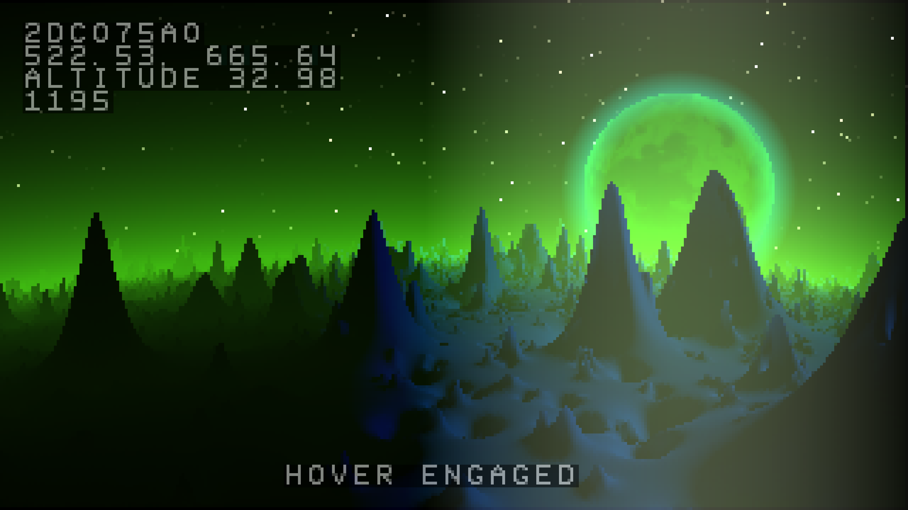

# octavia noise
a fractal noise algorithm named after a very nice cat

this is functionally similar to well known fractal noise algorithms such as value noise, perlin noise, or simplex noise, but does not exhibit the same grid artifacts. it's useful for situations which benefit from organic feature placement or very natural slope distribution (when using perlin or value noise in slope-intensive applications, grid artifacts can be a problem). 

this is most closely related to cellular noise algorithms such as worley noise.

## parameters
this has the parameters you'd expect from perlin or value noise: octaves and amplitude ratio (aka roughness or persistence). because the structure of it is so different, it also has several other tuning parameters which can yield interesting textural effects.

### octaves

like perlin or value noise, this adds successively finer features via additional layers of noise. this is the only parameter which affects speed- it's linearly slower the more octaves are combined. right to left: one octave, six, twelve.

### amplitude ratio

this is also known as roughness or persistence. this governs how the octaves are combined. finer octaves have this height relative to the next size up. left to right: 3/8, 1/2, 5/8. lower values will allow the lower frequencies to define the texture, while higher favor the finer details. 1/2 is default, which will yield an amplitude series of 1, 1/2, 1/4, 1/8, 1/16...

### softness

0-1. this governs the falloff used for each sample point. the default is 1, which is as continuous as possible. lower softness values can result in steeper, more defined grains, pits, or spires. 

### bias, range

these parameters set the height of each sample. bias is the base value, and range is a random spread above and below it. 0 range will make every sample be exactly the same height. left to right: -1 bias, range 0, 1 bias, range 0, 0 bias, range 1
